<!-- paginate: false -->

# Abaixo aos prints, ode aos logs!
### Renan de Assis

---
# Quem sou eu?

- (auto descrição)

---
# Quem sou eu?

- Bacharel em Física

---
# Quem sou eu?

- Bacharel em Física
- Trabalho com engenharia de software no Serasa

---
# Quem sou eu?

- Bacharel em Física
- Trabalho com engenharia de software no Serasa
- Gosto de vôlei, jogos de tabuleiro e tenho uma tatuagem do desenho Avatar
* Ajudo na organização de eventos Python Brasil

---
<!--- paginate: true -->

# AVISOS

---

# AVISOS

* Contexto de aplicações web
* Minhas considerações do que **eu** aprendi na vida
* Tudo aqui é debatível
* Palestra informativa e pra deixar gostinho de curiosidade

<!--
* Aplicações que ficam o tempo inteiro de pé (em loop infinito, digamos assim) rodando em um servidor recebendo requisições.
* Não sei como seriam usados logs em outros contextos se outra hora alguém viesse me falar
* Vou passar por cima de alguns conceitos aqui, visto que é uma palestra informativa e pra deixar gostinho de quero mais
-->

---

# O que são logs?

---

# Não tem nada a ver com logaritmo

---
# O que são logs?

>> É uma expressão utilizada para descrever o processo de **registro** de **eventos** relevantes em um sistema computacional.¹

* Registro: "escrever" ou "marcar" algo em algum lugar
* Eventos que aconteceram no **passado** e podem ser **observados**

<!-- _footer: 1. https://pt.wikipedia.org/wiki/Log_de_dados -->
---
# Eventos relevantes?

Exemplos de eventos:
1) **log**in
2) **log**off
3) Algum erro no sistema
4) Um sucesso em uma requisição externa

---
# Quando usar prints?

* Retorno rápido em ambiente local
* Script de uso único

---
# Quando usar logs?

---
<!--- _paginate: hold -->

# Quando usar logs?

**TODO O RESTO**

<!-- A seguir vou mostrar algumas funcionalidades dos logs que não existem nos prints e como é uma ferramenta poderosa -->

---
# Lib padrão de logging do python

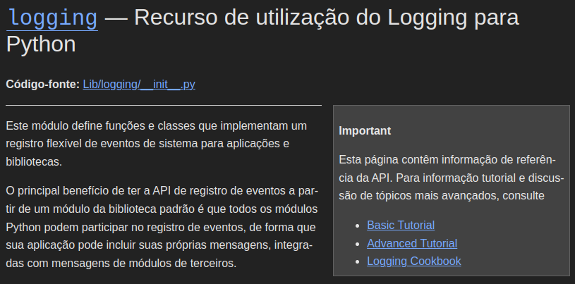

<!-- _footer: https://docs.python.org/pt-br/3.11/library/logging.html -->

---
# Conceitos de logs - níveis
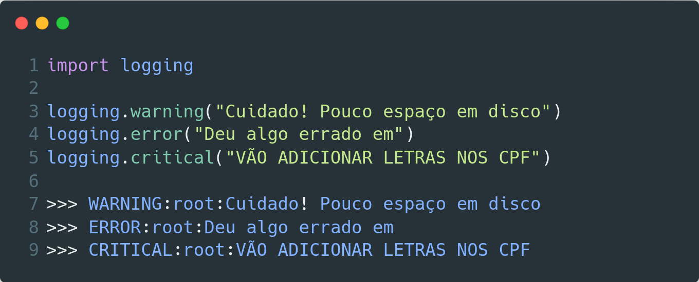

---
# Conceitos de logs - níveis
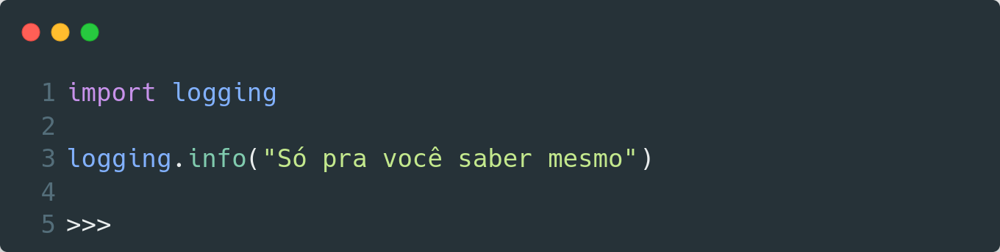

---
# Conceitos de logs - níveis
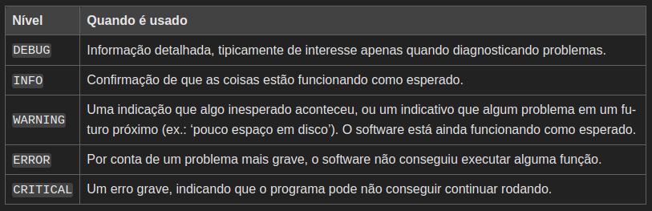

<!-- _footer: https://docs.python.org/pt-br/3/howto/logging.html#logging-howto -->

---
# Conceitos de logs - formatação
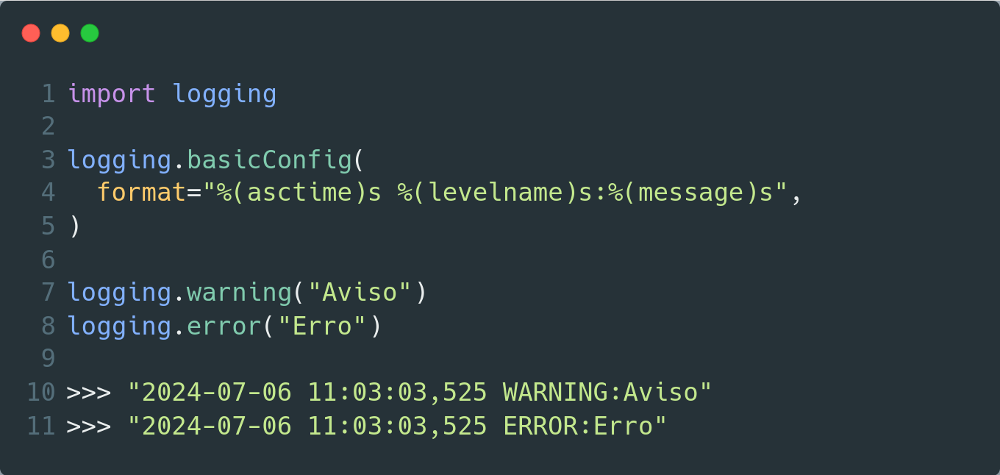

---
# Conceitos de logs - formatação
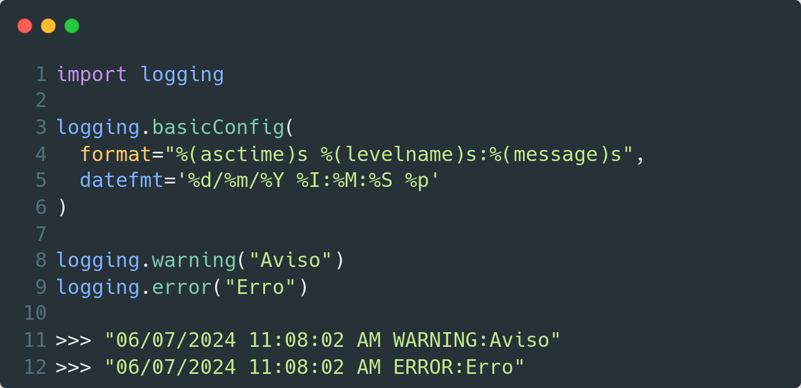

---
# Conceitos de logs - armazenamento

- Relembrando: logs são registros de eventos em algum lugar

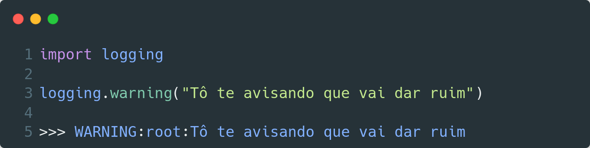

---
# Conceitos de logs - armazenamento

- Relembrando: logs são registros de eventos em algum lugar

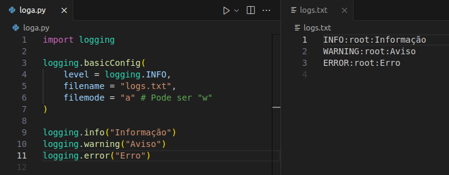

---
# Logs + computacão em nuvem

<!-- 
No desenvolvimento web atual costumamos usar plataformas de computação em nuvem como a do Google (GCP) ou da Amazon (AWS)
-->
- GCP(Google), AWS(Amazon), Azure(Microsoft), etc
- Serviços para monitorar, armazenar e acessar logs:
  - Cloud Logging (Google) 
  - CloudWatch (AWS)
  - Monitor Logs (Azure)

  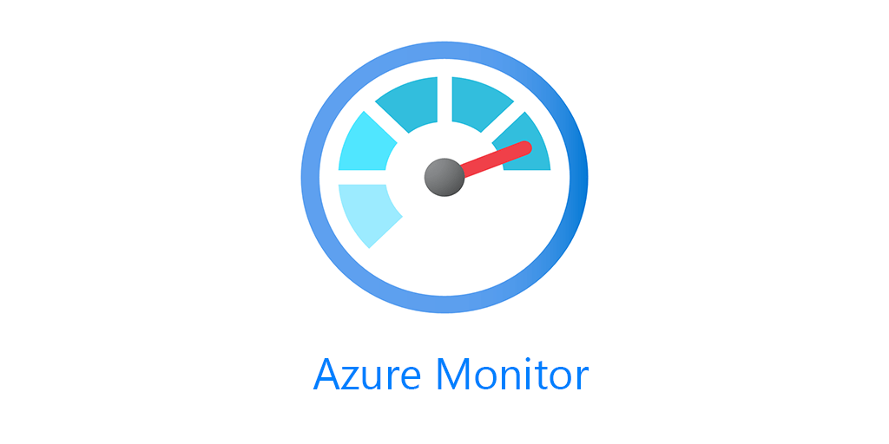

---
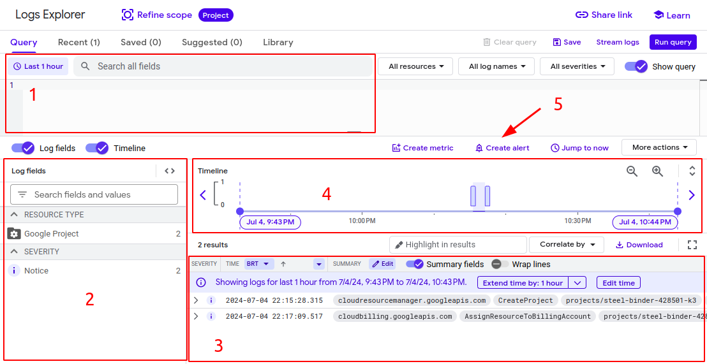

---

# Logs + ferramentas de observabilidade

- Existem ferramentas muito mais poderosas de monitoramento da performance das aplicações (APM)
- Podem integrar com serviços de computação em nuvem
- Logs, traces, infraestrutura, rastreio de erros, dashboards, etc

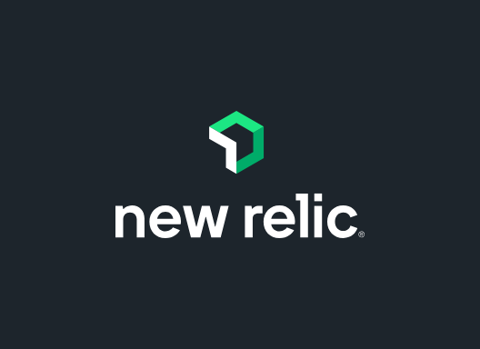  

---

# Alternativa à biblioteca logging

---

---

# Simplificação de logs em python com loguru

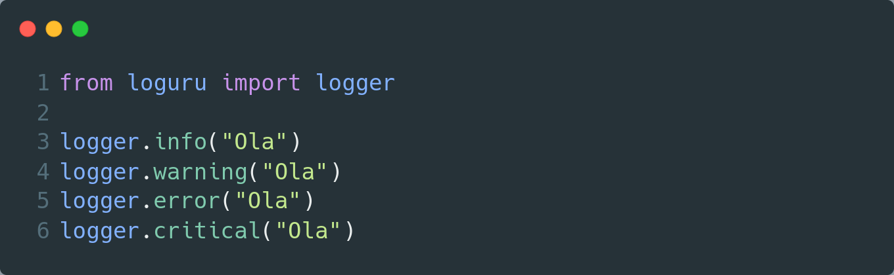

<!-- _footer: https://loguru.readthedocs.io/en/stable/ -->

---

# Simplificação de logs em python com loguru

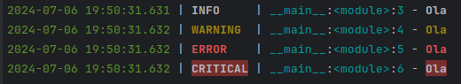

---

# Simplificação de logs em python com loguru

Apenas um comando para configurações

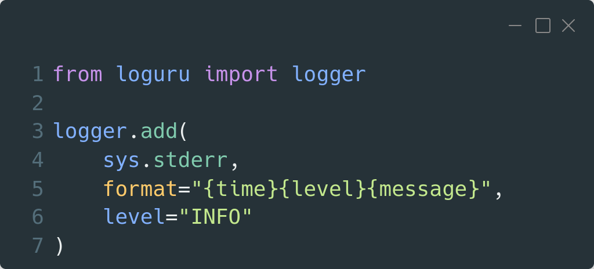

---

# Simplificação de logs em python com loguru

Formatação de strings com sintaxe mais recente **{ }** ao invés de **%**

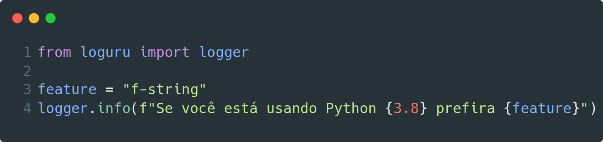

---

**A MELHOR FUNCIONALIDADE**
(na minha opinião)

---

**Logs estruturados**

---

# Simplificação de logs em python com loguru

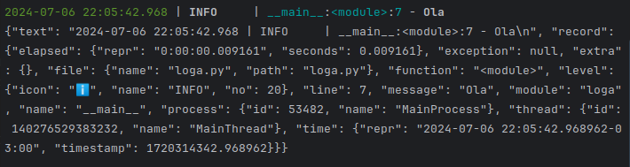

- Saída do log em formato JSON
- Informações facilmente manipuláveis

---

# Simplificação de logs em python com loguru

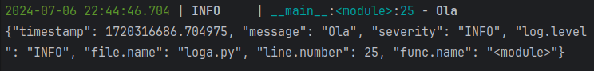

---

# Simplificação de logs em python com loguru

- Consigo adicionar informações personalizadas do meu fluxo

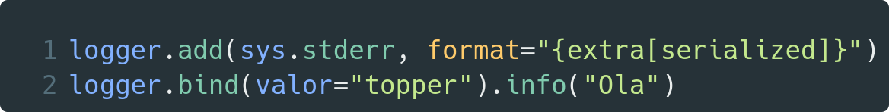
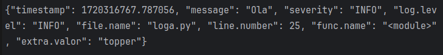

---

# Simplificação de logs em python com loguru

- E adicionar essas informações em todo um contexto

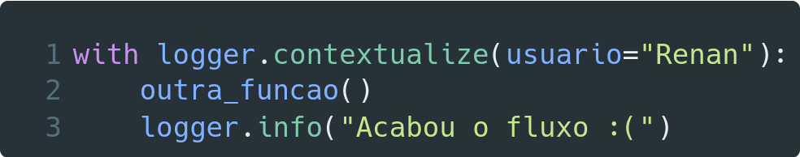

---
# Resumo da ópera

- Logs são registros de eventos relevantes em um sistema computacional
- Usem prints apenas em situações específicas
- A lib de logging padrão é extremamente poderosa e personalizável
- Usem, testem, fuçem o loguru

---
# Agradecimentos

* Eduardo Mendes (vide Dunossauro) pela [live de python Nº198](https://www.youtube.com/watch?v=PGAOqAWuwC0) sobre logs que inspirou essa palestra

---
## Dúvidas?

Linkedin: /in/renan-asantos/
Telegram: @renan_asantos
Github: renan-asantos

<!--

https://github.com/marp-team/awesome-marp?tab=readme-ov-file#themes

https://github.com/dunossauro/fastapi-do-zero/tree/main/slides

https://marpit.marp.app/usage?id=constructor-options

https://dev.to/andyhaskell/write-your-tech-talk-slides-rapidly-with-marp-2c7g

https://stackoverflow.com/questions/69154809/how-to-align-image-below-text-header-in-marp-or-marpit

https://ayharano.github.io/pyse2024/#/

-->