

# Construindo uma cultura de code review :rocket:
### Renan de Assis

---
## Sumário

1. O que são PRs e Code Reviews?
2. Benefícios do code review
3. Dicas para autores de uma PR
4. Dicas para revisores de PRs

---
## Quem sou eu?

- (auto descrição)

---
## Quem sou eu?

- Bacharel em Física

---
## Quem sou eu?

  

- Bacharel em Física
- Engenheiro de software na Serasa
  
  

  

  

---
## Quem sou eu?

- Bacharel em Física
- Engenheiro de software na Serasa
- Jogo vôlei, adoro jogos de tabuleiro e tenho uma tatuagem do desenho Avatar
- Ajudei uns anos na organização dos eventos Python Brasil

---

## AVISOS

---

## AVISOS

- Minhas considerações do que **eu** aprendi na vida
- Tudo aqui é debatível

---
## O que são PRs?

>> Pull Request é um recurso de plataformas de hospedagem de código Git para propor mudanças em um projeto de uma branch para outra.¹

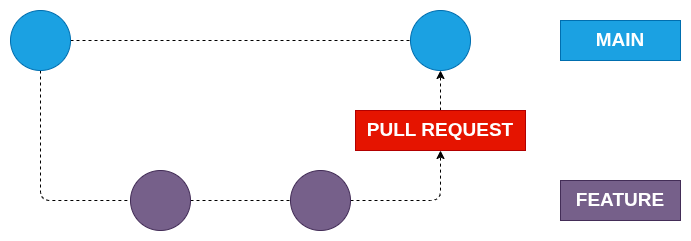

<!-- _footer: 1. Definição própria -->
---

## O que são ~~PRs~~ MRs?

  

Gitlab possui um nome que eu prefiro: __MRs ou Merge-Requests__

  

  

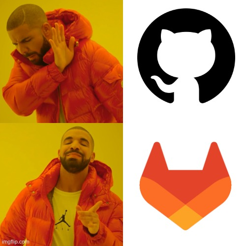

  

<!--
PR é porque o mantenedor do projeto vai ter que dar um pull depois das alterações realizadas
MR é porque o autor da MR vai mergear as alterações na branch de destino
-->

<!-- _footer: 1. Definição própria -->
---
## O que são MRs?

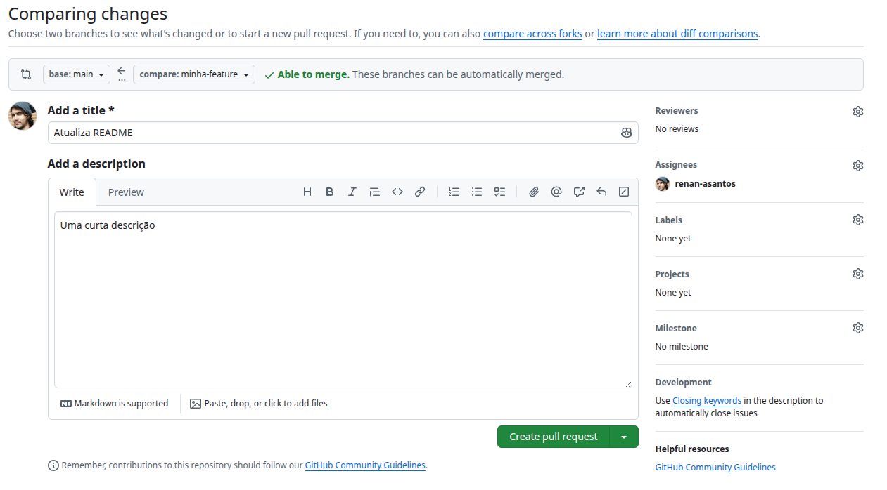

---
## O que são MRs?

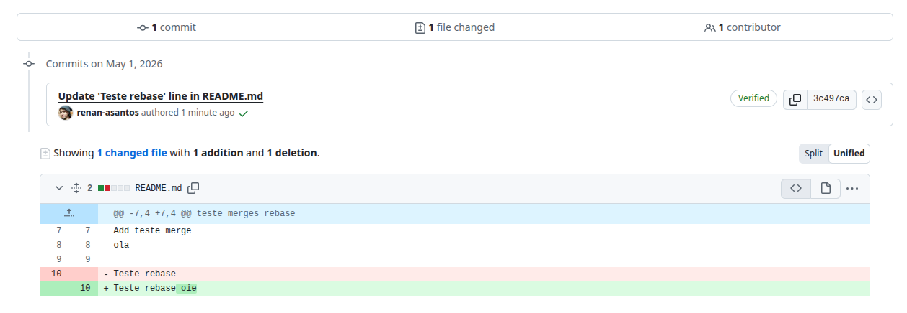

---

## O que são Code Reviews?

>> Revisão de código é o processo no qual o autor de uma MR disponibiliza seu código para pelo menos uma outra pessoa avaliar, essa podendo adicionar comentários para o entendimento, estabelencendo-se um diálogo¹

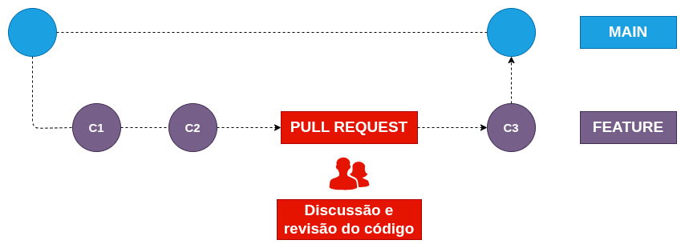

<!-- _footer: 1. Definição própria -->

<!--
O revisor pode adicionar comentários no código sob revisão, procurando esclarecer dúvidas, sugerindo melhorias, indicando bugs, etc.
Estabelece-se um "diálogo" na forma de troca de comentários entre o autor do código e o seu revisor.
-->

---

## O que TAMBÉM É Code Review?

  

- Pair Programming, só que assíncrono
* Parte da tarefa
* Última barreira pré produção
* Acordo entre o time/área/empresa
  
  

  

  

<!--
Parte da tarefa: não tem como subir na main sem alguém revisar e sua tarefa só acaba quando vai pra main
-->

---

## O que NÃO É Code Review?

* Tarefa do time de QA
* "Bala de prata"

<!--
* Não vai testar e2e
* Não vai pegar TODOS os possíveis bugs
-->

---

## Benefícios do Code Review

* Além de identificar, previne possíveis bugs
* Aumenta a qualidade do software escrito
* Diminui o risco de dívidas técnicas
* __Oportunidade de aprendizado (para ambos)__

---

## Benefícios do Code Review

Uma boa cultura de code review pode indicar falhas no seu processo...

* Complexidade da tarefa
* Entendimento do que era preciso
* Necessidade

<!--
1. Quanto tempo em review? Quantos arquivos alterados? Ficou muito tempo porque o codigo tava grande e era pesaroso de revisar? Pode indicar que as tasks nao estao bem quebradas

2. Quantas alterações foram pedidas? A pessoa que fez nao entendeu bem a task? nao sabe muito bem como trabalhar naquele projeto?

3. Depois de aprovada ficou parada? Era mesmo tao importante aquela alteracao?
-->

---
<!-- _class: slide-secao -->

## Dicas para autores de uma MR

---
## Dicas para autores de uma MR

- MRs pequenas
- Sem juntar várias mini melhorias

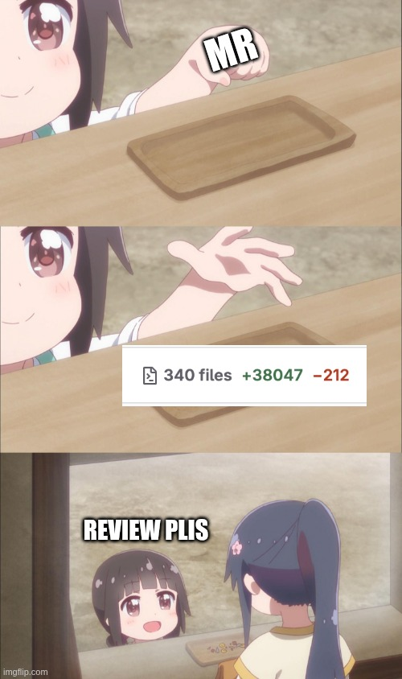

---
## Dicas para autores de uma MR

  

O primeiro revisor é sempre **você**
- CI
- Conflitos
- Testes unitários
- Subiu em dev?
  
  

  

  

---
## Dicas para autores de uma MR

  

- Verifique se existe o `CONTRIBUTING.md`
- Siga os padrões que o projeto tiver
- Se tiver um linter e/ou formatter, roda ele também
  
  

  

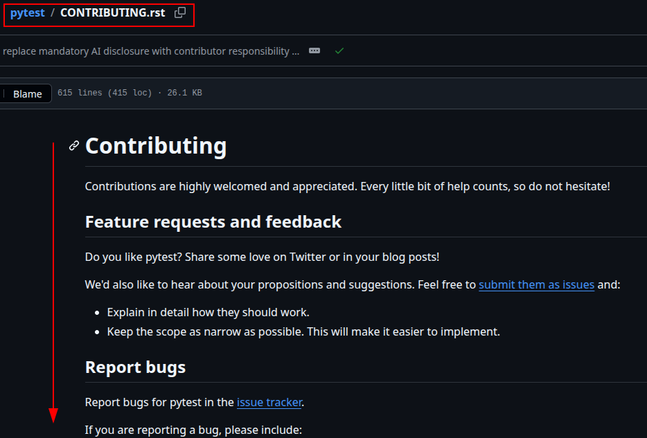

  

---
## Dicas para autores de uma MR

  

Crie uma MR em draft
- opinião rápida sobre a abordagem
- “erre rápido” para corrijir rápido
  
  

  

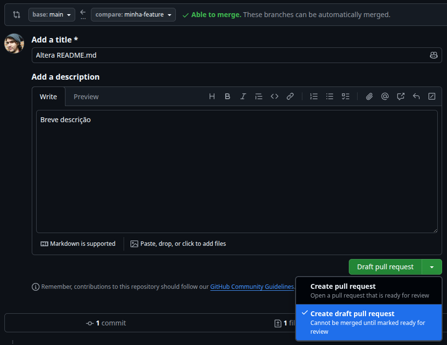

  

---
## Dicas para autores de uma MR

  

Crie uma MR em draft
- opinião rápida sobre a abordagem
- “erre rápido” para corrijir rápido
  
  

  

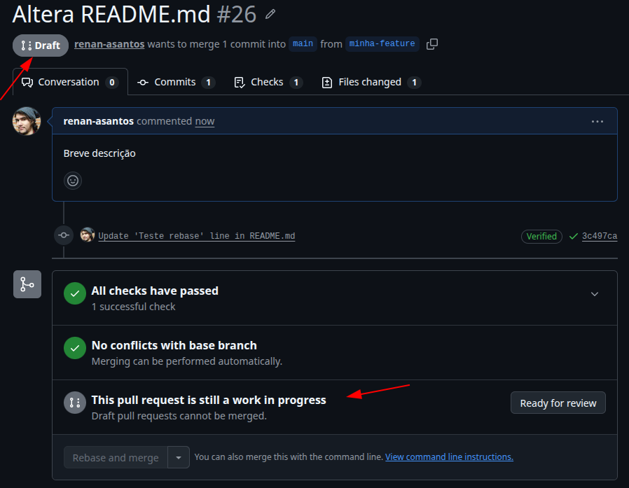

  

---
## Dicas para autores de uma MR

  

Forneça __contexto__ para quem vai ler a MR
- Escreva uma descrição clara e bem exemplificada
- Adicione imagens, gifs, vídeos
  
  

  

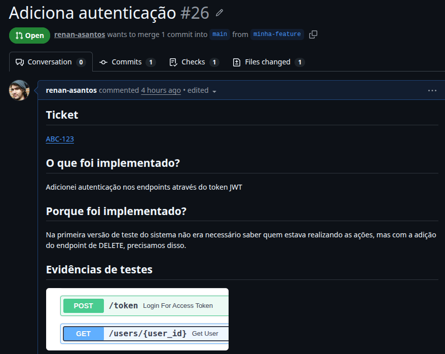

  

---
## Dicas para autores de uma MR

  

- Discutir nos comentários, não no pv
- Responda o quanto antes os comentários
- Muitas sugestões de melhoria? Abra outro ticket
  
  

  

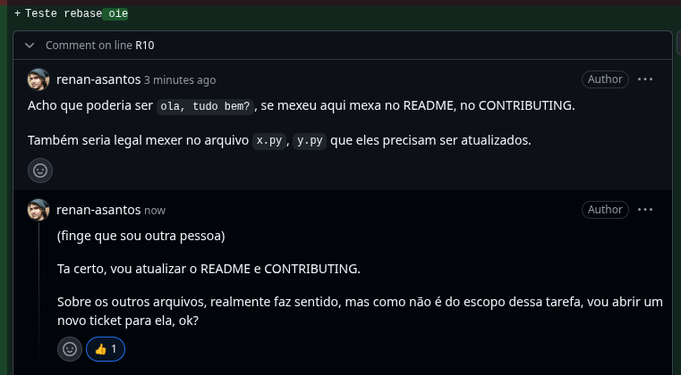

  

<!--
5. Discuta as sugestões de preferência nos comentários da própria PR para que todos vejam ou acompanhem e se não estiverem se entendendo, façam uma ligação.
6. Se a sugestão que outra pessoa der for modificar muito o código ou não impactar negativamente, pergunte se pode abrir um ticket de dívida técnica linkando aquela sugestão
-->

---
## Dicas para autores de uma MR

  

- Não leve para o pessoal, você não é seu código
- __Seja gentil__
  
  

  

  

<!--
Vira um bate bola rapido e fecha logo a mr

Sempre responda um comentário, mesmo que com um emoji 🙂, não feche o comentário que alguém fez uma pergunta, a pessoa nao sabe se voce acatou, recusou a sugestao etc

Não leve para o pessoal, você não é seu código
-->

---
<!-- _class: slide-secao -->

## Dicas para quem vai revisar a MR

---
## Dicas para quem vai revisar a MR

  

Adquira contexto antes de revisar
- O autor caprichou na descrição? Então use-a!
- Leia o card atrelado à tarefa

  

  

  

---
## Dicas para quem vai revisar a MR

_Roteiro pessoal_
- Começe pelos arquivos não de código fonte, adições de libs, arquivos de configurações, documentação
- Alterne entre o código fonte e os testes
- Siga o fluxo desde o começo, por exemplo 
  `endpoint` -> `service` -> `utils`

---
## Dicas para quem vai revisar a MR
Nos arquivos de código...

  

- Analise nomes de variáveis, estão claros e intuitivos?

  

  

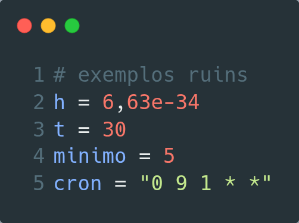

  

---
## Dicas para quem vai revisar a MR
Nos arquivos de código...

  

  

  

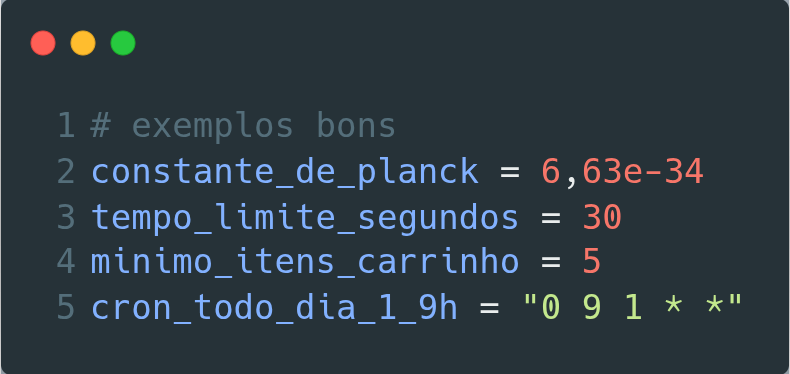

  

---
## Dicas para quem vai revisar a MR

  

Nos arquivos de código...

- Existe over-engineering?
- Quem ler entenderá a solução no futuro? 

  

  

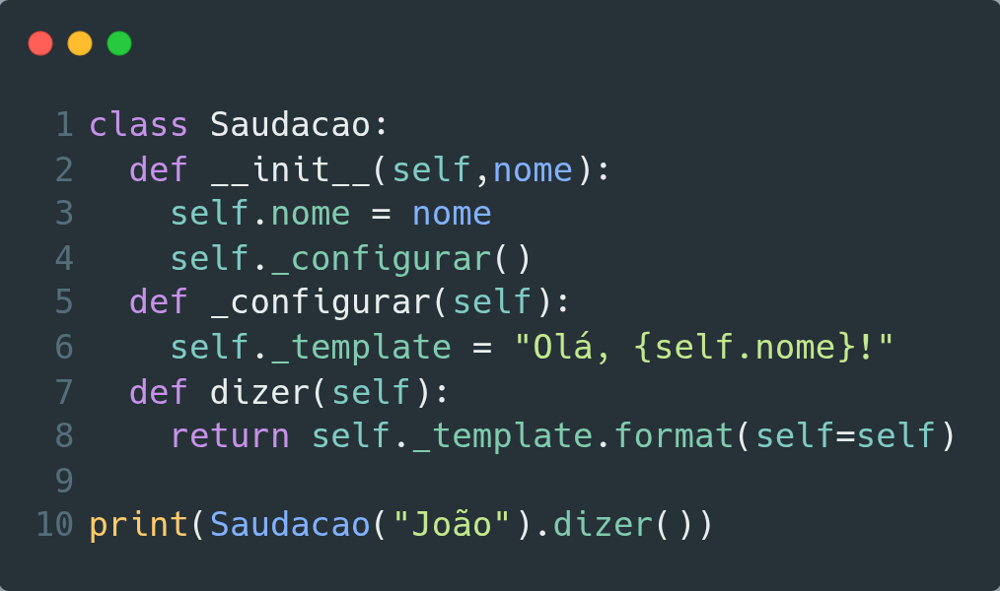

  

---
## Dicas para quem vai revisar a MR

  

Lembre do Zen do Python:

>> Simple is better than complex

  

  

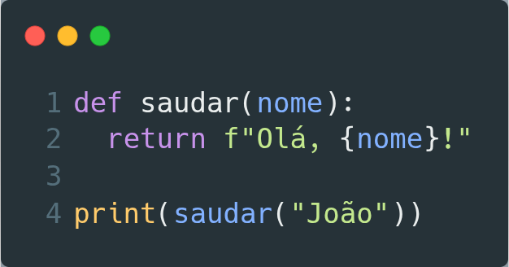

  

---
## Dicas para quem vai revisar a MR
Nos arquivos de testes...

  

- Estão corretos e bem arquitetados?
- Bons nomes?

  

  

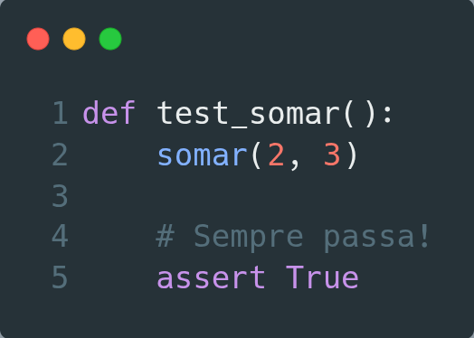

  

---
## Dicas para quem vai revisar a MR
Nos arquivos de testes...

  

- Estão corretos e bem arquitetados?
- Bons nomes?

  

  

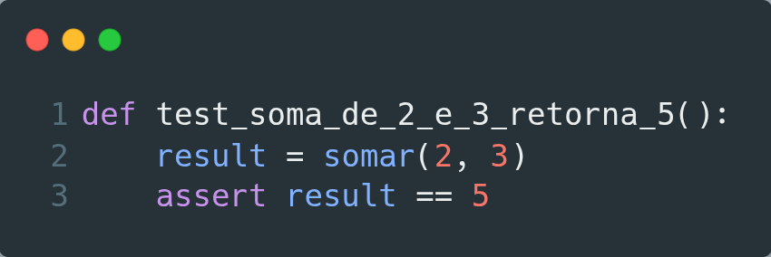

  

---
## Dicas para quem vai revisar a MR
Nos arquivos de documentação...

- Tem algo que precisa ser atualizado na documentação?
- A forma de subir local mudou em algo?

---
## Dicas para quem vai revisar a MR

  

Nas MRs mais críticas, faça checkout da branch, rode você mesmo e valide

  

  

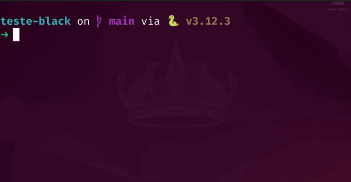

  

---
## Dicas para quem vai revisar a MR
Ao comentar na MR...

- Adicione sugestões de código

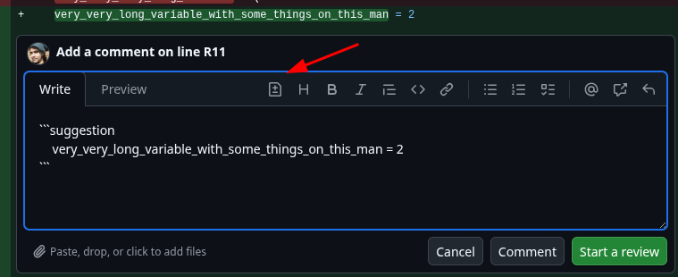

---
## Dicas para quem vai revisar a MR
Ao comentar na MR...

  

- Selecione trechos de código específicos
- Explique sua sugestão, coloque referências, exemplos, imagens, etc

  

  

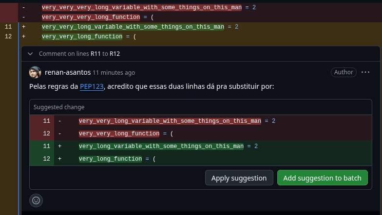

  

---
## Dicas para quem vai revisar a MR
Ao comentar na MR...

- __Enalteça__ pontos interessantes, elogie códigos bons e comente se aprendeu algo novo

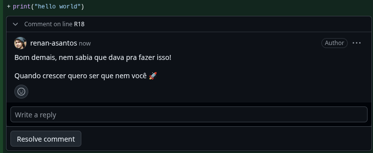

---
## Dicas para quem vai revisar a MR

  

- Se você não está revisando a MR de alguém, essa pessoa está travada.

  

  

  

---
## Dicas para quem vai revisar a MR

  

- Não façam LGTM
- Sem approve da confiança

  

  

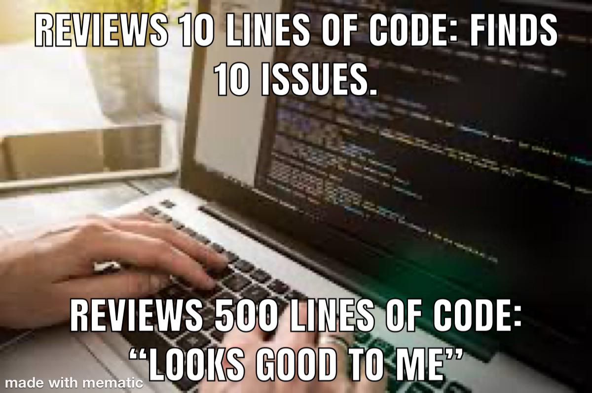

  

---
## Dicas para quem vai revisar a MR

  

- Cuidado com o efeito manada
- Revisem, nem que seu review não "conte"

  
  

  

  

<!--
Não é porque o senior e spec aprovou que voce nao pode negar e revisar com calma. "Só porque uma figura de autoridade aprovou, não significa que você deve ignorar seu próprio julgamento.” você deve também revisar as PRs dos sêniors/specs com igual critério. 

Não é só porque eles são mais experientes que não cometem erros
-->

---
<!-- _class: slide-secao -->

## O que quero que levem com vocês

---
## O que quero que levem com vocês

* Code review é um pair programming assíncrono ("diálogo")
* Parte da __sua__ tarefa
* Aumenta a qualidade do software
* __Oportunidade de aprendizado__

---
# Agradecimentos

  

Palestra do [André Girol de Code Review na Python Brasil 2021](https://www.youtube.com/watch?v=qgouvDvfz6k)

  

  

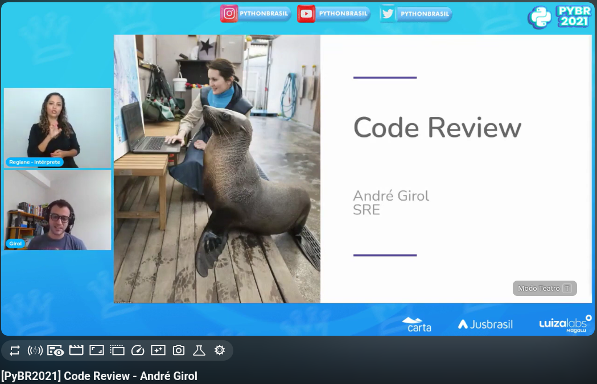

  

---
## Dúvidas?

  

Linkedin: /in/renan-asantos/
Telegram: @renan_asantos

  

  

Slides no QRCode

  

<!--

**Resumido (40min)**

1. Quem sou eu? (1min)
2. O que são PRs e Code Reviews? (3min)
3. Importância de code reviews (4min)
4. Code reviews na era da IA (3min)
5. Dicas para autores de uma PR (12min)
6. Dicas para revisores de PRs (12min)
7. Dúvidas (5min)

1. Quem sou eu? (conectar minha história com o tema, "Passei por projetos onde code review era um 'ritual de aprovação' sem sentido e outros onde era a chave para o crescimento do time. Hoje quero compartilhar o que aprendi nessa jornada.”)
2. O que são PRs e Code Reviews? (prefiro muito mais o termo do Gitlab MR, mas PR é mais popular)
    1. Pair Programming só que assíncrono, isso da benefícios e malefícios
    2. O que é Code Review? Parte da sua task, reducao de bugs, custos, troca de conhecimento
    3. O que não é? QA (n vai testar e2e), bala de prata (n da pra pegar todos os bugs)
3. Importância de code reviews
    1. Aumentar a qualidade do software
    2. diminuir o risco de dívidas técnicas
    3. oportunidade de aprendizado e trocas de conhecimentos (para ambos)
    4. Última barreira pré produção (Explicar o que é produção)
    5. Um bom code review pode indicar falhas no seu processo
        1. Complexidade: Quanto tempo em review? Quantos arquivos alterados? Ficou muito tempo porque o codigo tava grande e era pesaroso de revisar? Pode indicar que as tasks nao estao bem quebradas
        2. Precisão: Quantas alterações foram pedidas? A pessoa que fez nao entendeu bem a task? nao sabe muito bem como trabalhar naquele projeto?
        3. Necessidade: Depois de aprovada ficou parada? Era mesmo tao importante aquela alteracao?
    7. Memes de REVIEW REBELO, xkcd
4. Code Reviews na era de IA
5. Dicas para autores de uma PR:
    1. PRs PEQUENAS
    2. O primeiro revisor é sempre você (verifique os testes, se subiu em dev, se o CI ta passando, se não tem conflitos a serem resolvidos)
    3. Siga os padrões que o projeto tiver (line-lenght, code-style, etc etc), se tiver um linter, formatter, pre-commit, rode ele (CONTRIBUTING.md)
    4. Escreva uma descrição clara e bem exemplificada do que seu código altera, com imagens, vídeos, formatação boa, como testar. Documentação futura da funcionalidade
    10. Crie uma PR em draft, “erre rápido” para corrijir rápido, opinião rápida sobre a abordagem
    5. Discuta as sugestões de preferência nos comentários da própria PR para que todos vejam ou acompanhem e se não estiverem se entendendo, façam uma ligação.
    6. Se a sugestão que outra pessoa der for modificar muito o código ou não impactar negativamente, pergunte se pode abrir um ticket de dívida técnica linkando aquela sugestão
    7. Responda o quanto antes os comentários que as pessoas fizerem. Vira um bate bola rapido e fecha logo a mr
    8. Seja gentil, sempre responda um comentário, mesmo que com um emoji 🙂, não feche o comentário que alguém fez uma pergunta, a pessoa nao sabe se voce acatou, recusou a sugestao etc
    9. Não leve para o pessoal, você não é seu código
6. Dicas para quem vai revisar a PR
    0. Não façam LGTM (Look Good To Me), não façam approve da confianca, é algo para ser acordado entre todos do time
    1. Não sei como funciona em cada empresa, mas revisem, nem que seu review não “conte”
    2. Leia atentamente a descrição da PR, se houver. "O autor caprichou na descrição? Então use-a! Ela é seu guia para entender o contexto e o que testar.”
    3. Leia o card atrelado a ela, se houver (ali podem existir boas informações de negócio para te dar contexto)
    4. A solução é adequada ao projeto, em termos de design de código? Segue os code style?
    5. Existe over-engineering? Muita complexidade? Quem ler entenderá a solução no futuro? Lembrando do Zen do Python “Simple is better than complex”
    6. Começem pelos arquivos não do código fonte em si (modificação no pyproject ou requirements seja para libs ou configurações; README,)
    7. Sigam para os arquivos de testes automatizados, estão corretos e bem arquitetados?
    8. Ao ir para os arquivos de código…
    9. Vejam nomes de variáveis, estão claros? foo, bar, var, etc. Ao inves de um comentario explicando a variavel, poderia ela mesmo ter um nome explicativo (exemplo do cron)
    10. Tem algo que precisa ser atualizado na documentação? Mudou a forma de subir local e precisa atualizar o README? Alguma env foi modificada?
    11. Não vai dar pra fazer em todas, mas naquelas mais críticas, faça checkout da branch, rode no seu ambiente local, valide por si mesmo, mas não gaste muito tempo nisso
    12. Coloque sugestões de código e nao só de palavras, mande o trecho como sugestao pra pessoa, exemplo feature gitlab
    13. Explique sua sugestão de alteração da PR, coloque referências, exemplos etc
    14. Enalteça pontos interessantes, elogie códigos bons, comente se aprendeu algo novo
    17. Efeito manada: não é porque o senior e spec aprovou que voce nao pode negar e revisar com calma. "Só porque uma figura de autoridade aprovou, não significa que você deve ignorar seu próprio julgamento.” você deve também revisar as PRs dos sêniors/specs com igual critério. Não é só porque eles são mais experientes que não cometem erros
    18. Se você não está revisando uma PR de alguém, ela está travada por sua causa. Se não estiver extremamente focado em algo, se tiver acabado de sair de uma reunião e tem 30min até a próxima, via revisar
7. Referências
    1. Palestra Code Review do Andre Girol - https://www.youtube.com/watch?v=qgouvDvfz6k

-->