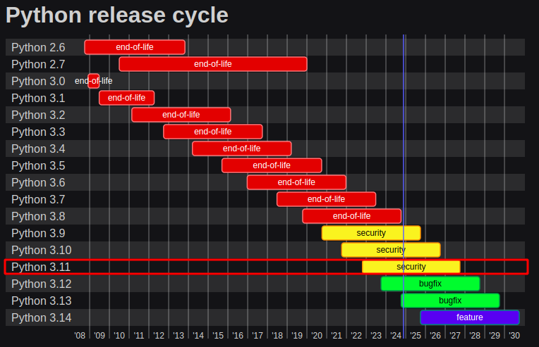
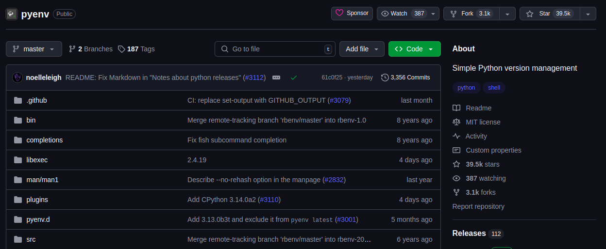
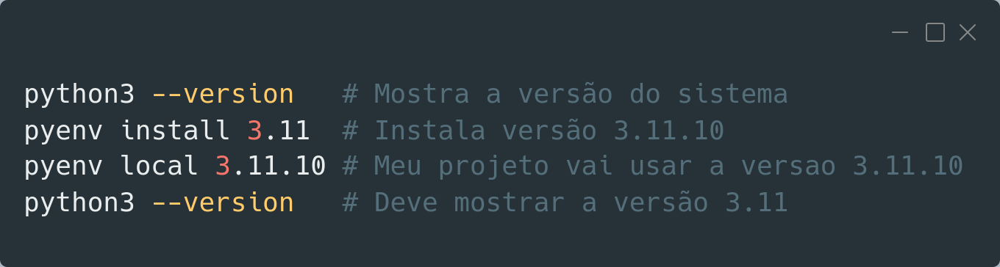
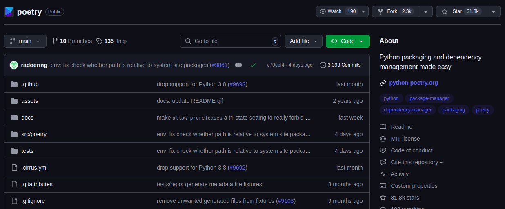
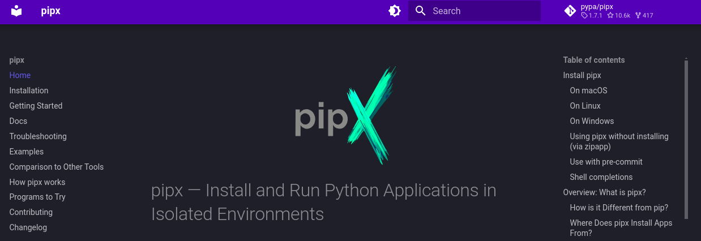
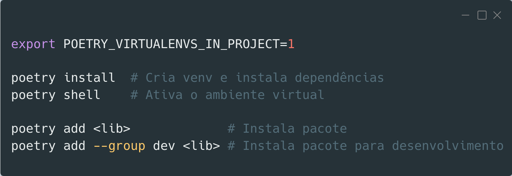
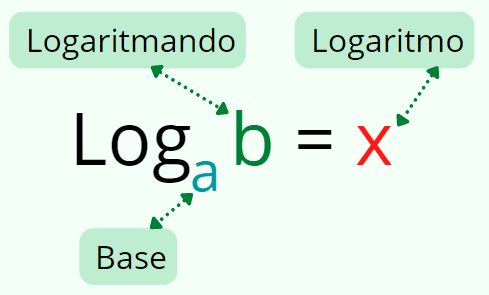
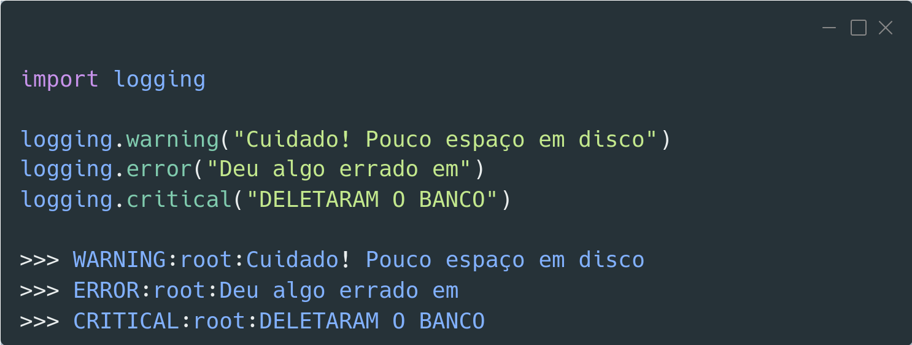
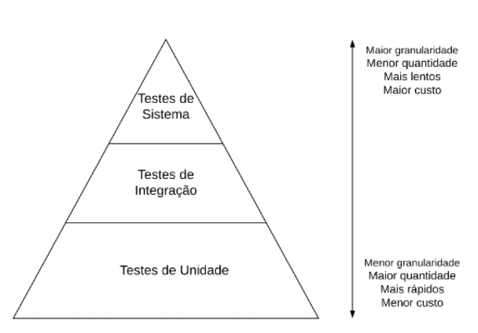

<!-- paginate: false -->

# Evoluindo o sistema
### Ana Dulce
### Renan de Assis

---

# Quem é o Renan?

- (auto descrição)

---
# Quem é o Renan?

- Bacharel em Física

---
# Quem é o Renan?

- Bacharel em Física
- Trabalho com engenharia de software no Serasa

---
# Quem é o Renan?

- Bacharel em Física
- Trabalho com engenharia de software no Serasa
- Gosto de vôlei, jogos de tabuleiro e tenho uma tatuagem do desenho Avatar
* Ajudo na organização de eventos Python Brasil

---
# Quem é a Ana?

---

# Motivação

- Diversas oficinas e cursos de "crie sua primeira API"
* O sistema ficou pronto, mas e agora? (imagem de swagger fastapi pronto)

<!--
- Sempre vi tutoriais de criar a primeira API com algum framework, 
seja com flask, django ou fastapi.
- É bem legal saber fazer isso mesmo, é a parte principal para nosso sistema
estar minimamente funcional, mas um projeto de software não acaba aí.
-->
---

# Motivação

- Existem muitos outros recursos "em volta" da API para melhorar nosso sistema
  - Qualidade
  - Confiabilidade
  - Observabilidade
  - Facilidade de manutenção

<!--
Existem muitos outros recursos para adicionarmos para melhorar a qualidade, confiabilidade e capacidade de manutenção do nosso projeto.
Isso que vamos fazer juntos no dia de hoje
-->
---

# Alinhamentos iniciais

* Contexto aplicações web
* Não levem como verdade absoluta
* O que essa oficina **não** vai abordar?
  - Como **criar** uma API com nenhum framework de Python
  - Funcionamento detalhado de uma API

<!--
Primeiro de tudo queríamos deixar claro alguns alinhamentos iniciais:
- aplicações web
- não é verdade absoluta, vamos apresentar uma forma de fazer, existem muitas outras
- o que essa oficina não vai abordar
  - como criar api: como dito, queremos saber o que ocorre DEPOIS de criada a API
  - Detalhes de como funciona uma API
-->
---

# O que essa oficina vai te mostrar?

1) configuração do ambiente
2) documentação
3) logs
4) testes

5) formatadores
6) análise estática
7) automação de comandos
8) automação com git hooks

<!--
configurar o ambiente com um sistema já existente
-->

---

# BORA TIMEE

---

# Em que passo estamos?

1. configuração do ambiente
2. documentação
3. logs
4. testes

5. formatadores
6. análise estática
7. automação de comandos
8. automação com git hooks

---

# Configuração do ambiente

- Ambiente Unix-like
- Clonar projeto
- Versão do python: 3.11 (sugerido usar pyenv)
- Gerenciador de dependências: poetry
- Ambiente virtual ativo
- Subir o projeto

---

# Clonar o projeto

- Para essa oficina vamos usar o projeto X que foi feito ontem na oficina de FastAPI da Ana Dulce

link do projeto (bitly, sei la como)

---

# Versão do python

<!-- _footer: https://devguide.python.org/versions/ -->
---

# Versão do python

---

# Agora é com vocês! :wink:

- Instalar o pyenv
- Rodar os comandos abaixo
  
- Quem já conseguiu pode ler sobre ou tentar instalar o poetry

---

# Gerenciador de dependências

- Um sistema pode ser composto de código nosso e de outras pessoas
- Geralmente precisamos instalar bibliotecas (dependências)
- Precisamos de uma ferramenta para auxiliar nessa tarefa
- Exemplos: Pip, pipenv, poetry, uv

<!--
Pip é o instalador de dependências padrão do Python
Pipenv é da Python Packaging Authority (Pypa) 
Poetry tem o lema "Python packaging and dependency management made easy", é uma ferramenta muito conhecida na comunidade
uv é uma ferramenta lançada esse ano e está em constante desenvolvimento
-->

---

# Poetry

---

# Um passo atrás...

- Algumas bibliotecas de python são úteis no nosso ambiente global de desenvolvimento
- O `poetry` é uma delas, podemos citar também o `ansible`, `cookiecutter`, `pyinstaller`
- Seria uma boa opção instalar no python do sistema?
- Qual a outra opção?

---

# Pipx

- Um ambiente isolado só para essas ferramentas "globais"
- Similar ao `brew` do MacOS, `npx` do Javascript e `apt` do Linux

<!--
Instalar pipx todos juntos
Ler instruções de instalação com calma e ver qual versao do pipx vc vai estar
De preferencia a ultima, se tudo der errado instalar via pip
-->

---

# Voltando para o Poetry (testar direitinho com projeto da ana)

package-mode=false
poetry config virtualenvs.in-project true
poetry config virtualenvs.prefer-active-python true

---

# Subir o projeto

- Subir o projeto (comando sei la)
- Bater na url do /docs, ver o swagger e chamar um dos endpoints com sucesso
- então é isso, já ta pronto e funcional, ta fazendo sua atividade fim
- agora vamos melhorar as "bordas" dele

---

# Em que passo estamos?

1. ~~configuração do ambiente~~
2. documentação
3. logs
4. testes

5. formatadores
6. análise estática
7. automação de comandos
8. automação com git hooks

---

# Documentação

Para poder documentar o sistema, é bom entender minimamente o que ele faz

(Ana explica explica minimamente o que o projeto faz e quais os endpoints, como o banco está estruturado etc)

---

# Documentação

(gráfico de visualizacao do banco se der)
acho que da pra meter um mkdocs simples em, ver live do du (https://www.youtube.com/live/O3bs4JtHrow) minuto 1h35
Meter mkdocs

---

# Em que passo estamos?

1. ~~configuração do ambiente~~
2. ~~documentação~~
3. logs
4. testes

5. formatadores
6. análise estática
7. automação de comandos
8. automação com git hooks

---

# Logs

- O que são? Onde vivem? Como se alimentam?
* Não tem nada a ver com logaritmo

---
# Logs

>> Expressão utilizada para descrever o processo de **registro** de **eventos** relevantes em um sistema computacional.¹

* Registro: "escrever" ou "marcar" **algo** em **algum lugar**
* Eventos que aconteceram no **passado** e podem ser **observados**
* Exemplos de eventos relevantes: **log**in, **log**off, algum erro no sistema, sucesso em uma requisição externa
* Local do registro pode ser a saída do terminal, um arquivo, um servidor de email

<!-- _footer: 1. https://pt.wikipedia.org/wiki/Log_de_dados -->

---
# Logs

---

# Logs: em que contribuem?

- Monitoramento da aplicação
  - Criando gráficos do comportamento do sistema
  - Entender o nível de criticidade do evento ocorrido
  - Auxílio para criar alertas

<!--
Geralmente o código fica rodando em um servidor sem acesso fácil de modificação e lá não conseguimos ver o que está acontecendo facilmente e nem mexer no código rapidamente para fazer um “debug”
...
Assim, precisamos de logs
-->

---

# Logs

- `poetry add loguru`

---

# Em que passo estamos?

1. ~~configuração do ambiente~~
2. ~~documentação~~
3. ~~logs~~
4. testes

5. formatadores
6. análise estática
7. automação de comandos
8. automação com git hooks

---

# Testes

- Software é uma construção complexa
- Logo, está sujeita a erros
- Assim, foram criados os testes para minimizar que os erros cheguem ao usuário

---

# Testes: em que contribuem?

- Previnem que bugs cheguem ao usuário (redução de custos)
- Auxiliam no entendimento do sistema
- Garantem o funcionamento do código depois de alterado (testes regressivos)

---

# Tipos de testes

<!--
- Testes de unidade: verificam pequenas partes de um código (classe, método, etc…); simples, mais fáceis de implementar e rápidos
- Testes de integração: verificam uma funcionalidade (ou transação) completa de um sistema; mais esforço, mais lentos
- Testes de sistema: simulam, da forma mais fiel possível, uma sessão de uso do sistema por um usuário real; mais caros, mais lentos e mais frágeis
-->

---

# Testes

- Focar só em unitario ou abranger de integração tbm?
- Pytest
- Falar de mock
- Usar padrão AAA (Arrange, Act, Assert)
- Como fazer um bom teste?

---

# Em que passo estamos?

1. ~~configuração do ambiente~~
2. ~~documentação~~
3. ~~logs~~
4. ~~testes~~

5. formatadores automáticos
6. análise estática
7. automação de comandos
8. automação com git hooks

---

# Formatadores automáticos

- O que são?
- No que contribuem para o nosso sistema?

---

# Análise estática (linters)

- O que são?
- No que contribuem para o nosso sistema?

---

# Automações (centralizado)

---

# Automatizando comandos no nosso sistema

- O que são?
- No que contribuem para o nosso sistema?

---

# Automatizando comandos no nosso sistema

- O que são?
- No que contribuem para o nosso sistema?

---

<!-- --

https://github.com/dunossauro/fastapi-do-zero/tree/main/slides

https://dev.to/andyhaskell/write-your-tech-talk-slides-rapidly-with-marp-2c7g

https://stackoverflow.com/questions/69154809/how-to-align-image-below-text-header-in-marp-or-marpit

-->